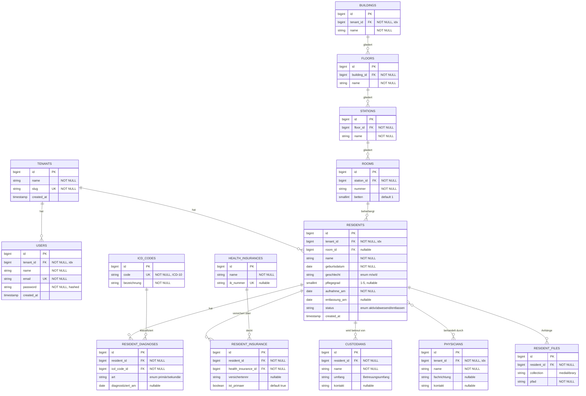
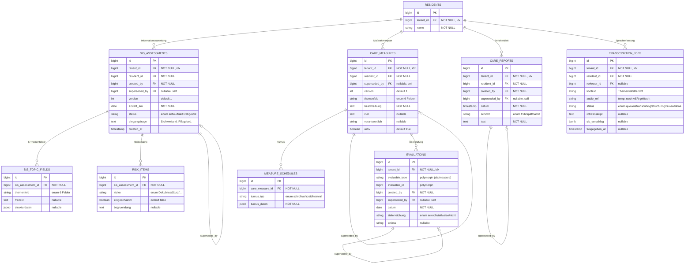

# OPCare — SIS®-basierte Pflegeplanung (Arbeitstitel)

Pflegedokumentations- und Pflegeplanungssystem für die stationäre Altenpflege, neu aufgebaut als
moderner Laravel-Stack. Geistiger Nachfolger des inaktiven Java-Projekts
**[Offene-Pflege.de (OPDE)](#herkunft)** — dessen erprobtes Stammdaten-Domänenmodell dient als Vorlage,
die Pflegeplanung wird jedoch von Grund auf nach dem **Strukturmodell / SIS®** neu modelliert.

> **Status:** In Entwurf/Design-Phase. Noch kein Produktivcode. Open Source.

---

## Tech-Stack

| Schicht | Technologie |
|---|---|
| Backend | **Laravel 12**, **PHP 8.5** |
| Datenbank | **PostgreSQL** |
| Frontend/PWA | Blade + **Livewire 3** + Alpine.js, Service Worker (installierbar), **Node (aktuelle LTS)** + Vite |
| Realtime | **Laravel Reverb** (WebSockets) |
| Queue/Monitoring | Redis + **Laravel Horizon** |
| Spracherfassung | lokaler **Whisper**-Dienst (ASR) |
| KI-Strukturierung | **Ollama**-LLM (on-prem via `three.linn.games`), Human-in-the-Loop |
| Sicherheit | RBAC (`spatie/laravel-permission`), Audit (`spatie/laravel-activitylog`), Verschlüsselung at-rest |

## Architektur — Bounded Contexts

Domänen-orientierte Struktur unter `app/Domains/` (PSR-4-Ordnerkonvention; `nwidart/laravel-modules`
bei wachsender Komplexität nachrüstbar). Pro Domäne: `Models/ Actions/ Data/ Policies/ Events/ Jobs/
Database/ Tests/`. Layering als Einbahnstraße: **Livewire/Controller → Action → Model/Service**, Daten
zwischen Schichten als DTOs (`spatie/laravel-data`).

- **Identity** — Auth, Benutzer, Rollen/Rechte, Mandanten-Scoping (`tenant_id` überall)
- **Masterdata** — Bewohner, Diagnosen/ICD, Krankenkassen, Betreuer, Ärzte, Gebäude/Zimmer
- **CarePlanning** — SIS®-Strukturmodell: Informationssammlung → Maßnahmenplanung → Berichteblatt → Evaluation
- **Speech** — Audio-Handling, Transkription, LLM→SIS®-Strukturierung

## Datenmodell

Konventionen: alle Tabellen `bigint id PK` + `tenant_id FK` (globaler Eloquent-Scope) +
`created_by`/`updated_by` + `timestamps`. Rechtlich relevante Einträge (SIS, Berichte, Evaluationen)
sind **append-only / versioniert** (manipulationssicher, MDK-konform): Korrekturen erzeugen eine neue
Version, die alte wird via `superseded_by` verkettet und bleibt erhalten. Audio wird nach erfolgreicher
Transkription gelöscht (Datensparsamkeit, Art. 5 DSGVO).

### Identity & Masterdata



### CarePlanning & Speech

`RESIDENTS` (oben definiert) ist der gemeinsame Anker; hier verkürzt dargestellt.



## Sprach-Workflow (Human-in-the-Loop)

```
Tablet (Mikrofon, Alpine/MediaRecorder)
  → Audio-Upload → Queue-Job
  → Whisper (lokal): Audio → Rohtranskript
  → Ollama-LLM: Rohtranskript → SIS®-Themenfeld-Vorschlag (jsonb)
  → Reverb-Broadcast zurück ins UI
  → Pflegekraft prüft/korrigiert/gibt frei (Human-in-the-Loop)
  → Speicherung als SIS-/Bericht-Eintrag · Audio wird gelöscht
```

## Scope v1

**Enthalten:** Stammdaten/Bewohnerverwaltung · SIS®-Pflegeplanung (4 Strukturmodell-Elemente) ·
voller Sprach-Workflow · RBAC · Audit-Trail.

**Bewusst später (Schema lässt Platz):** Medikation/BHP · Controlling/QMS · QDVS-Export ·
Mehrmandanten-Betrieb über mehrere Heime (`tenant_id` ist aber von Beginn an vorgesehen).

## Herkunft

Basiert konzeptionell auf **Offene-Pflege.de (OPDE)**, einem freien Java-Swing-Pflegedokumentationssystem,
das 2025 wegen der regulatorischen Anforderungen (EU Cyber Resilience Act, EU-Produkthaftungsrichtlinie)
eingestellt wurde. OPCare übernimmt dessen Domänenwissen (Stammdaten, QDVS-Mapping als Referenz), nicht
dessen Code.

## Lizenz

**AGPL-3.0** — schützt die Software auch im SaaS-/Netzwerk-Betrieb (Copyleft erstreckt sich auf
über das Netzwerk bereitgestellte Dienste).
